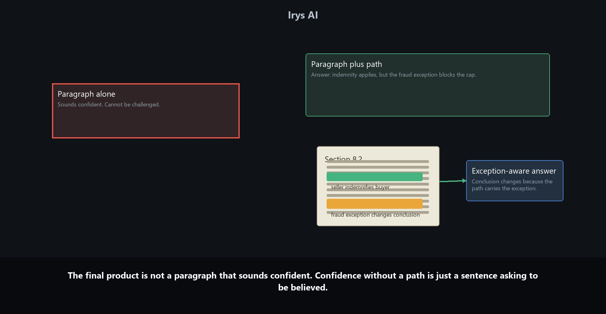

# Auditability Is The Product In Legal AI

The dangerous legal AI answer is not always the answer that looks wrong.

Often, it is the answer that looks finished.

It cites authority. It uses the right procedural vocabulary. It reaches a conclusion that sounds plausible. A busy reviewer can read it and think the system did the work because the output has the surface shape of legal analysis.

In a real review, that is not enough. The issue is not whether the answer sounds cautious. The issue is whether the reviewer can see that the answer carried forward the limitation, authority, exception, instruction, and procedural fact that governed the prior step.

If the path is hidden, the lawyer is not supervising the work. The lawyer is reconstructing it.

## The Research Memo Failure

Suppose a litigation team asks whether a particular claim is likely to survive a motion to dismiss.

The system reads a complaint, a few cases, and a prior internal memo. It drafts a short answer: the claim is likely to survive because the pleaded facts satisfy the required elements under the cited standard.

The answer looks useful. It names the standard. It cites a case. It mentions the allegations.

But the prior internal memo included a limitation: the strongest case applied a more plaintiff-friendly state pleading rule, while the current matter is in federal court. Another case in the research set narrows the same element in a way that matters for this complaint. The answer cited the favorable authority but did not carry forward the limitation.

That is a near-correct failure. It is not a hallucination in the cartoon sense. It is worse for a legal team because the work looks grounded while the support path is incomplete.

The lawyer needs to know where the path broke.

## "Ask Again" Is Not Supervision

Many AI products give the reviewer one blunt control: ask again.

That is not a repair process.

Asking again may produce different prose, but it does not tell the legal team what failed.

Did retrieval miss the limiting case?

Did extraction capture the holding but drop the procedural posture?

Did the system notice the state-versus-federal distinction but fail to connect it to the final answer?

Did the draft turn a narrow case comparison into a broad conclusion because the broad conclusion read more cleanly?

Did the reviewer note from the earlier memo fail to carry into the new draft?

Those are different failures. They need different repairs.

If every failure becomes "rerun the prompt," the team learns nothing about the workflow. The same weakness can repeat in the next research memo, the next draft brief, or the next client update.

Legal supervision needs a path the lawyer can inspect.

## What A Reviewable Path Looks Like

A serious legal AI workflow should let the reviewer start with the sentence being trusted and follow it backward.

Start with the sentence:

> The claim is likely to survive a motion to dismiss.

That sentence should not exist only as prose. It should be a claim the reviewer can inspect.

The reviewer should be able to follow the claim to the cases supporting it, the allegations it relies on, the procedural standard being applied, and the limitations that might weaken it. If the answer cites a case, the reviewer should see what proposition the case supports. If the answer uses a pleading standard, the reviewer should see whether that standard matches the forum. If the answer relies on a prior memo, the reviewer should see which note, caveat, or partner instruction came forward.

The goal is not to show every hidden log line. Most logs are noise to a lawyer. The goal is to expose the pieces of the work path that matter for legal judgment.

## The Bug Is Often A Missing Relation

In the research memo example, the failure is not simply that the model wrote a bad sentence.

The failure is the missing relation between a limitation and the conclusion that should have been constrained by it.

That distinction matters because it changes the repair.

The reviewer does not need to throw away the whole workflow. The reviewer can attach the limiting authority to the claim, mark the conclusion as qualified, and rerun only the affected synthesis. The allegations, useful case extract, prior memo reference, and reviewed notes do not have to be discarded.

The work that was right can remain. The work that was incomplete can be repaired.

One missing relation should not burn down the whole matter workflow.

## A Concrete Before-And-After

Without an audit path, the review looks like this:

1. The system writes a confident answer.
2. The lawyer suspects something is missing.
3. The lawyer rereads the cases and the complaint.
4. The lawyer finds the limitation.
5. The lawyer rewrites the answer manually.
6. The system learns almost nothing durable from the correction.

That is not a workflow. It is a detour through the old work.

With a reviewable path, the same correction becomes more precise:

1. The lawyer opens the conclusion.
2. The support path shows the favorable case and the complaint allegation.
3. The limitation from the prior memo is missing.
4. The lawyer attaches the limiting authority to the claim.
5. The conclusion is marked qualified.
6. The synthesis reruns with the limitation in view.
7. The corrected path remains available for the next draft, memo, or client update.

The difference is not cosmetic. In the second workflow, the correction becomes part of the matter.

## Auditability Gives The Team Better Controls

An answer with no path leaves the team with three bad choices:

- trust it;
- reject it;
- ask again.

None of those choices explains the failure.

An answer with a path gives the legal team better controls:

- inspect the source;
- inspect the extraction step;
- follow the support path;
- follow the limiting authority;
- preserve reviewed work;
- rerun only the part that failed.

That is the practical value of a reviewable path.

With a clean trace, the next question does not start from zero. It can route through reviewed matter state and reopen the source only where fresh support is needed.

With a broken trace, the lawyer starts over from the source set. That is expensive. It is also structurally wasteful because the team repeats work that should already have become durable matter context.

## Why This Matters For Legal AI Adoption

Legal AI adoption is not won in a demo.

It is won when a lawyer can use the system on real work without losing control. It is won when a knowledge management team can see how work product is grounded. It is won when legal operations can understand how the platform fits into the matter lifecycle. It is won when risk and compliance can see that privileged work is governed, reviewable, and not scattered across disconnected tools.

That is why auditability is practical, not academic.

If the answer cannot be traced, the lawyer has to redo the work. If the work cannot be reused, the matter does not compound. If the system cannot show what changed after review, the team cannot build trust over time.

The best legal AI systems will not only generate. They will preserve the work behind the generation.

## Why This Matters For Irys

Irys is matter-centric because legal work is matter-centric.

Research, drafting, redlining, comparison, document analysis, tasks, and collaboration should not live in separate tools with separate memories. They should share one context around the matter.

When that happens, work compounds.

A reviewed answer can inform the next draft. A corrected extraction can constrain the next memo. A source-backed research path can travel with the work product instead of disappearing after the chat ends. A redline position can remain tied to the clause, definition, and instruction that produced it.

For Irys, auditability means a legal team can inspect how a memo, clause, redline, or matter answer was produced: which document was used, which authority supports it, what limitation was considered, what changed during review, and what remains unresolved.

That trace is not compliance decoration. It is what makes AI-generated legal work usable inside real matters.

## The Product Is The Answer Plus The Path

For serious legal AI systems, confidence without a path is just a sentence asking to be believed.

The final product is not a paragraph that sounds confident.

The product is the paragraph plus the path you can challenge.

You should be able to ask where it came from, what it ignored, which source supports it, what confidence was attached, what changed after review, and which part of the workflow needs to rerun.

If the limitation changes the answer, the path has to carry it.

If the partner instruction changes the draft, the path has to carry it.

If the authority narrows the argument, the path has to carry it.

That is why auditability is not a feature around the product.

Auditability is the product.

## About Irys

- Website: https://www.irys.ai/
- LinkedIn: https://www.linkedin.com/company/irys-legal-ai
