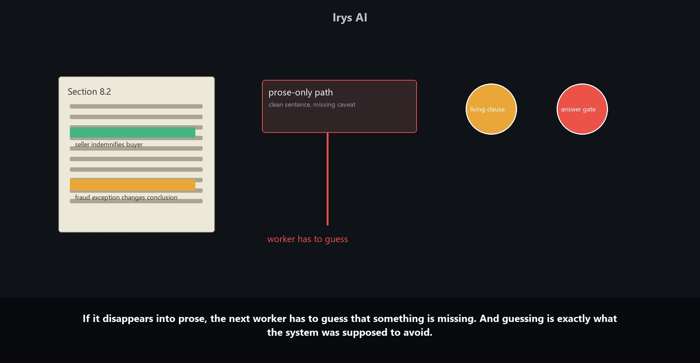

# Why Prompt-As-Memory Fails In Legal AI

Most legal AI memory failures do not announce themselves.

The answer still sounds careful. It names the right agreement. It quotes the right section. It uses the right legal vocabulary. The lawyer reading it does not see a system error, a missing-file warning, or a red flag that says the controlling exception fell out of memory two steps ago.

The failure hides inside work that looks ready to use.

In legal work, being broadly right is not enough. A memo can turn on a carve-out. A redline position can turn on a definition. A litigation strategy can turn on a procedural fact that looks minor until it controls the motion. A privilege analysis can turn on who received a document, when, and for what purpose. Legal work is full of small objects that matter more than the surrounding prose.

Prompt-based memory is weak at protecting those objects.

## The Mistake: Treating Memory As A Better Summary

The simplest way to give an AI system memory is to keep passing forward summaries.

A lawyer asks a question inside a matter. The system reads the agreement, summarizes the relevant clause, drafts an answer, and later reuses that answer in a memo or redline. To save context, each step inherits the last summary instead of the full state of the matter.

At first, this looks reasonable. Legal work already uses summaries. Lawyers summarize cases, diligence findings, contracts, calls, negotiations, and partner instructions all the time.

But a lawyer knows what kind of summary they are writing. A high-level client update, a diligence issue list, a research memo, a redline note, and a closing checklist do not preserve the same information. Each has a job. Each has an audience. Each makes tradeoffs.

A prompt summary usually does not know its future job. It compresses the past so the next step can keep moving. That can help a draft read smoothly, but it does not tell the next step which caveat must constrain a redline, which client instruction should govern a fallback position, or which open issue should stay unresolved until a partner decides it.

A useful summary helps someone understand what happened. Usable matter memory preserves what the next legal task is allowed to rely on.

## The Contract Example

Imagine a contract clause that says:

> The seller indemnifies the buyer for losses arising from breach of the agreement.

That sentence is easy to remember. It is short, direct, and sounds like the answer.

But five lines later, the same section says:

> The liability cap does not apply in cases of fraud.

That second sentence is smaller on the page, but it controls the conclusion. If the workflow loses it, the later answer can still sound legal while being wrong.

Prompt-memory systems are bad at catching failures like this. The system has not lost the whole matter. It has lost the one object that changes the answer.

## How The Error Enters The Workflow

The first AI step reads the clause and writes a safe summary:

> The seller indemnifies the buyer, subject to the fraud carve-out.

At this moment, the caveat is alive.

The second step receives a shorter version and writes:

> The seller indemnifies the buyer under the agreement.

The sentence is cleaner. It is also less faithful. The fraud carve-out has disappeared.

The final step answers from that compressed memory. The answer may be confident. It may even cite the right section. But the confidence is now part of the problem, because the missing caveat is no longer visible to the system.

Nothing dramatic happened. No model announced that it had lost the exception. The workflow just kept making the memory smoother.

Legal AI memory becomes false when the hard part disappears and the answer gets easier to use. The system doesn't become incoherent. It becomes too tidy.

## Why Larger Context Windows Do Not Fix This

A larger context window helps. It can hold more of the agreement, more of the pleadings, more of the diligence folder, more of the prior conversation. But larger context is not the same as durable matter memory.

Context gives the model a chance to see the sentence.

Matter memory decides whether the sentence survives the workflow.

The window does not know that a five-line exception should outrank a clean one-line summary. It does not know that a partner instruction from yesterday should constrain the draft today. It does not know that a definition buried in one exhibit controls the obligation being redlined in another. It can hold those facts, but it does not automatically preserve their role.

The system has to represent that role directly.

For legal AI, the harder question comes after retrieval: once the model has used the material, what stays attached to the work product?

## The Problem With One String Doing Every Job

In a prompt-memory workflow, too many different objects get flattened into one string:

- the legal claim;
- the source clause;
- the caveat;
- the defined term;
- the cited authority;
- the confidence level;
- the partner instruction;
- the open issue;
- the reviewer note;
- the audit trail.

That string has too many jobs. It has to preserve evidence, express uncertainty, carry instructions, remember provenance, and still read like a useful answer.

When it gets summarized, there is no protected place for the object that must survive. The caveat competes with the prose. The source thread competes with readability. The review note competes with the conclusion. The final answer may become easier to read at the exact moment it becomes less safe to rely on.

"We store the chat history" doesn't solve this.

A chat history is a record of what was said. A matter needs a record of what remains true, what remains unresolved, what has been reviewed, and what must constrain the next step.

## The Hard Part Is Reuse

The better design stores the right objects and decides what a later task is allowed to reuse.

This reuse decision is the hard system problem inside legal AI memory.

Each remembered object needs identity. The indemnity claim is not the same thing as the source clause. The fraud carve-out is not the same thing as the partner's negotiating instruction. A reviewer note is not the same thing as the final answer. If those objects collapse into one paragraph, the system can no longer tell which part is evidence, which part is judgment, which part is instruction, and which part is still unresolved.

Each object also needs provenance. A later draft should know whether a caveat came from the agreement, a case, a diligence call, a client email, or a partner's margin note. The same words can have different authority depending on where they came from. "Cap does not apply to fraud" means one thing when it is contract text. It means another when it is a proposed fallback. It means something else when it is a lawyer's unresolved note.

Then come update rules. If a partner changes the position, the old instruction should not simply vanish. The system needs to know whether the new instruction supersedes it, narrows it, conflicts with it, or applies only to one document. If two reviewers disagree, the memory cannot average them into a smooth sentence. It has to preserve the conflict until someone resolves it.

Finally, reuse needs permission. A reviewed clause extraction can safely constrain a later redline. An unresolved privilege call should not become a confident production-log entry. A client preference may travel across a matter; a draft-specific compromise may not. Matter memory is useful only when it carries enough state to make those distinctions.

The next legal task should inherit the matter state the paragraph came from:

- claim;
- caveat;
- source;
- definition;
- authority;
- instruction;
- confidence;
- review status;
- conflict status;
- permission to reuse;
- blocker.

The object set is smaller than the full source, but more faithful than a summary. It lets the system preserve the important parts of the matter without forcing every later step to reread every document from zero.

Consider a privilege review instead of a contract clause. An associate tags a thread as privileged because in-house counsel is copied. A partner later adds a note: on two messages, counsel appears to be acting in a business role, so the privilege call is unresolved until the team checks the surrounding communications.

The production log needs that uncertainty. A deposition outline may need it too. The client update should not turn it into a clean privileged/not-privileged answer.

If matter memory only stores the latest clean summary, the unresolved flag can disappear. If matter memory stores the participants, purpose, privilege basis, reviewer note, and open status separately, the later work inherits the uncertainty instead of forcing a model to rediscover it.

Matter memory keeps the legal constraint alive after the prose changes.

Here is the split between document-level AI and matter-level AI.

A document assistant can help with the sentence in front of it. It can summarize a clause, draft a provision, or answer from a file. Useful, but legal work rarely stays inside one file. A clause depends on a definition in another agreement. A privilege call depends on a communication history. A redline depends on the fallback a partner approved yesterday. A client update depends on which issues remain open.

Matter memory is the layer that lets those decisions travel across the work. Without it, the system keeps producing competent local answers while losing the state that makes the answer safe to reuse.

## What Irys Is Really Preserving

Legal teams do not need AI to remember everything with equal weight.

They need it to preserve the right distinctions.

Was this fact extracted from the source document or inferred by the model? Was this caveat reviewed? Does this instruction apply to the current draft or only to the last negotiation round? Is this issue open, closed, escalated, or blocked? Can the next task rely on it, or should it reopen the source?

Those are matter questions, not chat questions.

Irys is useful here because the matter is the unit of memory. Documents, research, drafts, redlines, review notes, generated work product, and institutional knowledge live around the same matter instead of being scattered across separate conversations. The useful memory is not "what the user said before." It is the structured work state the next legal step can safely inherit.

The claim is narrower and more practical than "the AI remembers." The platform keeps the controlling clause attached to the answer, the source attached to the extraction, the reviewer note attached to the issue, and the open status attached to the work product.

When that state survives, the next task is not guessing from a cleaned-up summary. It is working from the matter.

## The Trust Problem

For lawyers, this changes trust.

A lawyer doesn't trust work product because it sounds fluent. A lawyer trusts it when the chain of support is visible enough to inspect, challenge, and revise. The same standard applies to a junior associate's memo, a diligence chart, a draft brief, a contract markup, and an AI-generated answer.

If the system cannot preserve the controlling facts behind the answer, the lawyer has to supervise by rereading everything. That erases much of the value of the AI system.

If the system can preserve the controlling facts, the lawyer can supervise the work at the right level: checking judgment, resolving ambiguity, correcting the work, and approving the final work product.

The useful difference is legal work that carries its matter context with it.

## The Practical Takeaway

Prompt memory fails when the workflow asks prose to behave like infrastructure.

A prompt can carry text. It can't reliably protect the objects that must survive compression unless the system gives those objects structure.

For serious legal AI workflows, memory is the preservation of the right matter state across research, drafting, redlining, comparison, review, and reuse.

The next draft didn't need a nicer summary.

It needed the fraud carve-out still attached.
